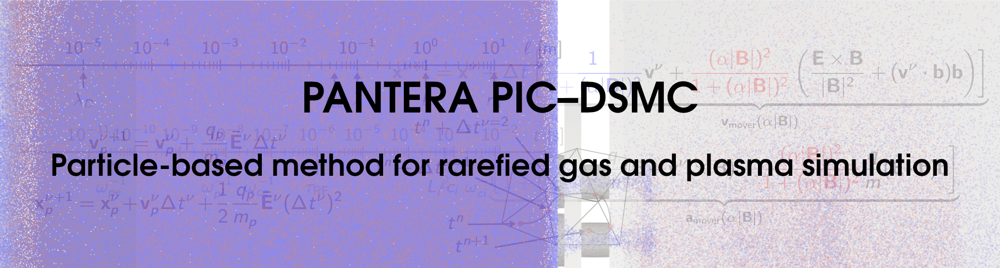

Copyright (C) 2025 von Karman Institute for Fluid Dynamics (VKI)

This program is free software: you can redistribute it and/or modify it under the terms of the GNU General Public License as published by the Free Software Foundation, either version 3 of the License, or (at your option) any later version.

# PANTERA PIC-DSMC

PANTERA (*PArticle Numerical Tool for non-Equilibrium Reacting Aerodynamics*) is an open-source software for the simulation of nonequilibrium gas and plasma flows based on the Direct Simulation Monte Carlo and Particle-in-Cell methods, written in modern Fortran and parallelized for distributed memory machines.

Main developers:
* Pietro Parodi - pietro.parodi@vki.ac.be - *VKI / KU Leuven*
* Jan Skácel - jan.skacel@vki.ac.be - *VKI / Masarykova univerzita / Université libre de Bruxelles*
* Stefano Boccelli - stefano.boccelli@nasa.gov   - *Politecnico di Milano / VKI / uOttawa / NASA Goddard*
* Federico Bariselli - federico.bariselli@vki.ac.be - *Politecnico di Milano / VKI*

Original DSMC code by Aldo Frezzotti - Politecnico di Milano. Main development is done at [the von Karman Institute for Fluid Dynamics](https://www.vki.ac.be/) under an FWO (Research Foundation - Flanders) PhD fellowship. See "history" section for a complete list of contributors.

## Applications and main features

PANTERA is extremely flexible in the possible applications. It has been applied to a variety of problems ranging from flow in micro-electromechanical devices to rarefied hypersonics to laboratory plasmas and plasmas for space propulsion. The main features are the following:

* Simulation of multiple species
* 1D, 2D, 3D, and 2D axisymmetric domains, always 3V (3 velocity components)
* Structured regular and unstructured grids (read in the [SU2](https://su2code.github.io/docs/Mesh-File/) format)
* DSMC Collisions using the pair-wise VSS coefficients and optionally binary reactions using the TCE model from modified Arrhenius rates and Borgnakke-Larsen internal energy exchange
* DSMC or MCC collisions and reactions from tabulated cross sections in the [LXCat](https://us.lxcat.net/home/) txt format
* Explicit as well as energy-conserving (semi-implicit and fully-implicit) electrostatic PIC schemes
* Possibility to restart a simulation from a saved state (particle dump)
* Many models including Maxwell and CLL surface scattering, dielectric solids, surface charging, surface reactions, externally applied electric and magnetic fields, ...

## Compiling, running and debugging

### Compiling

PANTERA has been designed and tested in the Linux environment. It uses the Message Passing Interface (MPI) for parallelization and the PETSc library to solve linear/nonlinear systems of equations.
To compile PANTERA, launch the `make` command in the main directory.
This will read the Makefile and create the "pantera.exe" executable. You can then copy this executable in the working directory.
Installing PANTERA requires you first install the [PETSc](https://petsc.org/release/) library, and correctly set the `PETSC_DIR` and `PETSC_ARCH` environment variables.
If it doesn't run, make sure that:
* you have a compiler installed (gcc)
* you have a version of MPI installed, such as [OpenMPI](https://www.open-mpi.org/) (in Debian/Ubuntu, packages `openmpi-common` and `libopenmpi-dev`).

### Running

After compiling, run PANTERA with:

(single process)
`$ ./pantera.exe`

(multi-process with MPI, with NUM_PROC the number of threads)
`$ mpirun -np NUM_PROC ./pantera.exe`

The minimum requirement is that you provide an input file. Pantera always reads the file "input" in the current folder.
Depending on what is defined in the input file, additional data files may be required.

### Debugging

By default, PANTERA is compiled with optimization enabled (-O3). Running make with `make debug` will instead compile an unoptimized version with the necessary information for debugging (-g) and additional compilation checks.

For debugging, you can use gdb. As long as you are running on one single machine for debugging purposes, you can use gdb even with multiple processes as follows:
`$ mpirun -np NUM_PROC xterm -e gdb pantera.exe`

This will run gdb on multiple xterm instances. Type "run" in them all to start the processes (they will likely wait for each other at the first MPI_BARRIER that they find.

## Additional notes

The manual for the code is in preparation. In the meantime, the Wiki in this Git repository contains some useful information and tutorials. Usage of the keywords in the input script can be deduced by looking at the `READINPUT` subroutine in `initialization.f90`.

### Input file

The input file is read by PANTERA in sequential order. When the content of a line is recognized as one of the keywords, the values in the right next line are saved into the proper variables. Don't put empty lines between the keyword line and the line with the values. Lines starting with `!` are recognized as comments and ignored. Example input scripts and the explanation of the keywords can be found in the Wiki on this Git repository.

With a few minor exceptions, the order in which the keywords appear in the input script is not important.

As a general rule, all values in the input script follow the SI system of units (m-kg-s).

### For the developer

A couple of notes for the developer.
You are very welcome to contribute to Pantera! Please try to keep the programming style similar to the one that you find (3 spaces for indenting, uppercase for language directives, variables and subroutine names).

Remember to write real numbers with a decimal, or at least a dot, as "2.", not just "2". Fortran is not Matlab and you will introduce a bug. Also mind divisions when integers are involved. You may get a zero where you naively expected a real number. Convert integers to reals for divisions. Remember that Fortran has inverse ordering of multidimensional arrays with respect to C/C++. This means that the first index identifies contiguous regions in memory/cache. Consequently, it is massively faster if the first index is the fastest to advance in a multi-dimensional loop.

BUT MOST IMPORTANTLY, FOLLOW THE KISS PHILOSOPHY: Keep It Simple, Stupid.

Keep in mind our aim:
* We want Pantera to grow in power and allow to run complex and compute intensive simulations
* *But* it must allow average-level programmers and students to develop it and include new physics. Many of us want to do physics, not CS... And mainly, an unnecessarily complex code will hinder development and lower the outcome of any programming effort.

Please, comment thoroughly the code. You will forget what you did and will need to refresh your memory. Others will need to understand (quickly) what you did to develop further.

### A bit of history

Pantera grew out from a DSMC code initially written by prof. Aldo Frezzotti, in F77. This code was parallelized in MPI and adapted in Fortran 90 by Federico Bariselli (["TheGambler"](https://www.politesi.polimi.it/handle/10589/177659) code).
Stefano Boccelli partially rewrote it to introduce hybrid PIC/DSMC capabilities.
Pietro Parodi developed and used the code during his Research Master and PhD work at VKI, introducing multi-species treatment, collision/reaction models, unstructured grids, various PIC solvers and more.

ASCII logo credits: S. Boccelli
